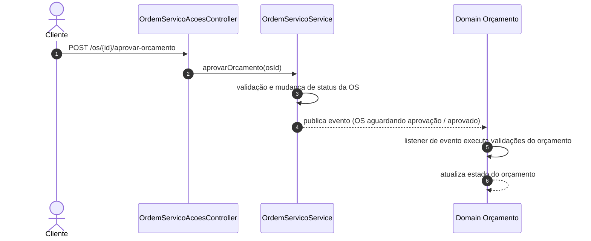
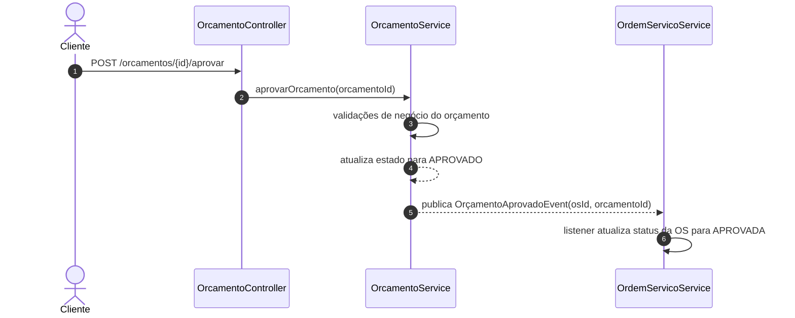

# ADR-022 - Inversão do Fluxo de Aprovação entre Ordem de Serviço e Orçamento

## 1. Contexto

- Atualmente o cliente acessa o endpoint de **aprovar orçamento** exposto em `OrdemServicoAcoesController`, utilizando a Ordem de Serviço (OS) como boundary externo.
- O **OrdemServicoService** executa a operação de aprovação e publica um evento de domínio (ex.: `OrdemServicoAguardandoAprovacaoEvent` ou equivalente) quando a aprovação ocorre.
- O **Orçamento** possui um listener que escuta eventos originados da OS para executar validações e atualizar seu próprio estado.
- Esse fluxo cria um acoplamento forte e invertido entre os bounded contexts **Ordem de Serviço** e **Orçamento**, violando:
  - o **Princípio de Responsabilidade Única (SRP)**, pois a OS acaba assumindo responsabilidade pela aprovação do orçamento;
  - o **Princípio da Inversão de Dependência (DIP)**, pois o contexto de Orçamento passa a depender de eventos disparados pela OS para exercer sua própria lógica de aprovação.
- A nomenclatura atual de comando no fluxo da OS utiliza o termo **"EmitirOrcamento"**, que na prática representa o encerramento do diagnóstico, gerando ruído de linguagem ubíqua.

Do ponto de vista de DDD e arquitetura hexagonal, a **aprovação do orçamento** deve ser uma decisão tomada e registrada no agregado **Orçamento**, e a **Ordem de Serviço** deve apenas reagir a esse fato de domínio, ajustando seu status conforme necessário.

## 2. Problema

- A **aprovação do orçamento** está sendo disparada a partir da **Ordem de Serviço**, o que inverte a direção natural do fluxo de domínio (a OS deveria reagir ao orçamento, não controlá-lo).
- O `OrdemServicoService` possui conhecimento detalhado do fluxo de orçamento, violando o princípio de **separação de responsabilidades entre bounded contexts**.
- O agregado **Orçamento** não é o verdadeiro proprietário da decisão de aprovação/reprovação no modelo atual; ele age mais como listener de eventos de OS do que como fonte de verdade.
- A nomenclatura **"EmitirOrcamento"** no fluxo de OS é enganosa: conceitualmente, a ação representa **finalizar o diagnóstico** para que um orçamento seja gerado, não a emissão em si.
- Esse desenho dificulta a evolução futura, por exemplo:
  - múltiplos orçamentos para a mesma OS;
  - diferentes canais de aprovação (portal do cliente, app, integrações);
  - regras de negócio específicas de aprovação/reprovação encapsuladas no agregado Orçamento.

## 3. Solução Proposta

### 3.1. Boundary e responsabilidades

- **Orçamento** passa a ser o **boundary de aprovação** exposto externamente:
  - O cliente (ou sistema externo) chamará um endpoint em `OrcamentoController` para aprovar ou reprovar um orçamento.
  - A lógica de aprovação/reprovação ficará concentrada em `OrcamentoService`.
- **Ordem de Serviço** deixa de comandar a aprovação do orçamento e passa a **reagir** a eventos de domínio gerados pelo Orçamento.

### 3.2. Mudanças principais

1. **Criar endpoint específico em `OrcamentoController` para aprovação/reprovação**
   - Novo endpoint REST, por exemplo:
     - `POST /api/orcamentos/{orcamentoId}/aprovar`
     - `POST /api/orcamentos/{orcamentoId}/reprovar`
   - O controller delega para `OrcamentoService` comandos como `aprovarOrcamento` / `reprovarOrcamento`.

2. **`OrcamentoService` emite eventos de domínio**
   - Ao aprovar um orçamento válido, o service dispara `OrcamentoAprovadoEvent` contendo as informações necessárias (ex.: ids do orçamento e da OS associada).
   - Ao reprovar, dispara `OrcamentoReprovadoEvent` (opcional nesta primeira fase, mas alinhado com o Event Storming fornecido).

3. **OS passa a ouvir eventos de Orçamento**
   - Um listener no contexto de Ordem de Serviço passa a ouvir `OrcamentoAprovadoEvent` (e `OrcamentoReprovadoEvent` quando implementado):
     - Ao receber `OrcamentoAprovadoEvent`, altera o status da OS para **APROVADA**, aplicando invariantes específicos da OS.
     - Ao receber `OrcamentoReprovadoEvent`, altera o status da OS para **REPROVADA** ou fluxo equivalente definido nas regras atuais.

4. **Renomear "EmitirOrcamento" para "FinalizarDiagnostico" no fluxo de OS**
   - No `OrdemServicoService` (e APIs/DTOs relacionados), renomear o comando para refletir melhor o momento de negócio:
     - De: `emitirOrcamento` / "EmitirOrcamento".
     - Para: `finalizarDiagnostico` / "FinalizarDiagnostico".
   - Essa operação continua existindo na OS, mas o seu resultado é a disponibilização de dados para geração de orçamento, e não a aprovação dele.

5. **Manter o evento `OrdemServicoAguardandoAprovacaoEvent`**
   - O evento continua existindo para representar que a OS concluiu o diagnóstico e está aguardando a decisão do cliente sobre o orçamento.
   - Esse evento segue sendo útil para notificações, auditoria e outros fluxos dependentes do status de **aguardando aprovação**.

## 4. Diagramas de Sequência

### 4.1. Fluxo atual (antes da mudança)

### 4.2. Fluxo proposto (após a inversão)

## 5. Impactos em Componentes

| Área                         | Componente                                      | Tipo de impacto                                   |
|------------------------------|-------------------------------------------------|---------------------------------------------------|
| API / Controllers            | `OrdemServicoAcoesController`                   | Remover endpoint de aprovação de orçamento        |
| API / Controllers            | `OrcamentoController`                           | Adicionar endpoints de aprovar/reprovar orçamento |
| Application Services         | `OrdemServicoServiceImpl`                       | Remover lógica de aprovação de orçamento; renomear comando para `finalizarDiagnostico` |
| Application Services         | `OrcamentoService`                              | Centralizar aprovação/reprovação e publicar eventos de domínio |
| Domain Events                | `OrdemServicoAguardandoAprovacaoEvent`         | Mantido para fluxo de diagnóstico                 |
| Domain Events                | `OrcamentoAprovadoEvent` / `OrcamentoReprovadoEvent` | Criar novos eventos de domínio                     |
| Event Listeners             | Listeners de `OrdemServicoAguardandoAprovacaoEvent` | Ajustar se dependerem da semântica antiga         |
| Event Listeners             | Listener da OS para `OrcamentoAprovadoEvent`    | Novo listener para atualizar status da OS         |
| Testes Unitários            | Serviços e listeners relacionados               | Atualizar testes para refletir novo fluxo         |
| Testes de Integração        | Fluxos de aprovação de orçamento e OS           | Atualizar cenários e asserts                      |
| Documentação / Insomnia     | `docs/api/insomnia_export.json`                 | Atualizar chamadas de aprovação de orçamento      |

## 6. Plano de Transição

### 6.1. Fases de implementação

1. **Preparação de domínio e infraestrutura**
   - Criar `OrcamentoAprovadoEvent` (e `OrcamentoReprovadoEvent`, se já desejado) e o listener em OS.
   - Implementar os métodos de aprovação/reprovação em `OrcamentoService` sem expor ainda o novo endpoint.
   - Garantir que os testes unitários cobrem as novas invariantes.

2. **Exposição do novo endpoint em `OrcamentoController`**
   - Adicionar endpoints REST de aprovação/reprovação.
   - Atualizar a coleção do Insomnia e documentação de API.
   - Criar testes de integração para validar o fluxo completo (aguardando aprovação → aprovado/reprovado).

3. **Transição de chamadas do endpoint antigo para o novo**
   - Atualizar front-end, scripts de testes e automações para utilizar o endpoint de `OrcamentoController`.
   - Manter, temporariamente, o endpoint antigo em `OrdemServicoAcoesController` como façade:
     - Implementar o endpoint chamando internamente o novo fluxo de `OrcamentoService`, mantendo compatibilidade.

4. **Remoção do endpoint antigo e ajuste de nomenclatura**
   - Remover o endpoint de aprovação em `OrdemServicoAcoesController` após confirmar que não há mais consumidores.
   - Renomear comandos e métodos de "EmitirOrcamento" para "FinalizarDiagnostico" em OS.
   - Atualizar testes, documentação e diagramas.

### 6.2. Estratégia de rollback

Caso a mudança apresente problemas em produção:

- Manter uma feature flag ou configuração que permita desabilitar o listener de `OrcamentoAprovadoEvent`, retornando à lógica antiga temporariamente.
- Preservar, durante a transição, a capacidade de aprovação via endpoint antigo em OS (mesmo que internamente delegando para o novo fluxo), permitindo reverter a exposição pública de `OrcamentoController` sem quebrar o sistema.
- As alterações em banco de dados são mínimas ou inexistentes (apenas semânticas de evento e status), o que facilita o rollback lógico via código.

## 7. Decisão

- **Implementar a inversão do fluxo de aprovação** entre Ordem de Serviço e Orçamento conforme descrito neste ADR.
- **Orçamento** passa a ser o owner da decisão de aprovação/reprovação; **OS** apenas reage via eventos de domínio.
- Manter o evento `OrdemServicoAguardandoAprovacaoEvent` para representar o fim do diagnóstico e o início da etapa de aprovação do cliente.
- Renomear "EmitirOrcamento" para "FinalizarDiagnostico" no contexto de OS para alinhar a linguagem ubíqua.
- Garantir **backward compatibility** durante a transição, mantendo temporariamente o endpoint antigo como façade.
- Priorizar a implementação dessa mudança na **próxima sprint**, alinhando com as demais iniciativas de refino de domínio.

**Status:** Proposed

## 8. Critérios de Aceitação

- Um orçamento pode ser aprovado/reprovado exclusivamente via endpoints de `OrcamentoController`.
- Ao aprovar um orçamento, o status da OS relacionada é atualizado para **APROVADA** via processamento de `OrcamentoAprovadoEvent`.
- Ao reprovar um orçamento (quando implementado), o status da OS é ajustado conforme a regra definida (ex.: **REPROVADA** ou retornando para estado anterior).
- Não existe mais lógica de aprovação de orçamento dentro de `OrdemServicoServiceImpl`; o serviço apenas gerencia estados da OS e o fluxo de diagnóstico.
- A nomenclatura "FinalizarDiagnostico" está refletida em código, documentação e testes, substituindo "EmitirOrcamento" no contexto de OS.
- Todos os testes unitários e de integração são atualizados e permanecem passando com cobertura mínima alinhada ao padrão do projeto.
- A coleção do Insomnia (`docs/api/insomnia_export.json`) contém os novos endpoints de aprovação/reprovação de orçamento e não referencia mais o endpoint antigo de OS.

## 9. Referências

- Diagramas do Event Storming anexos ao repositório de documentação do domínio de Orçamento e Ordem de Serviço.
- *Domain-Driven Design: Tackling Complexity in the Heart of Software* (Eric Evans).
- Padrões de arquitetura hexagonal (Ports & Adapters) aplicados à separação entre controllers, application services e domínios OS/Orçamento.

