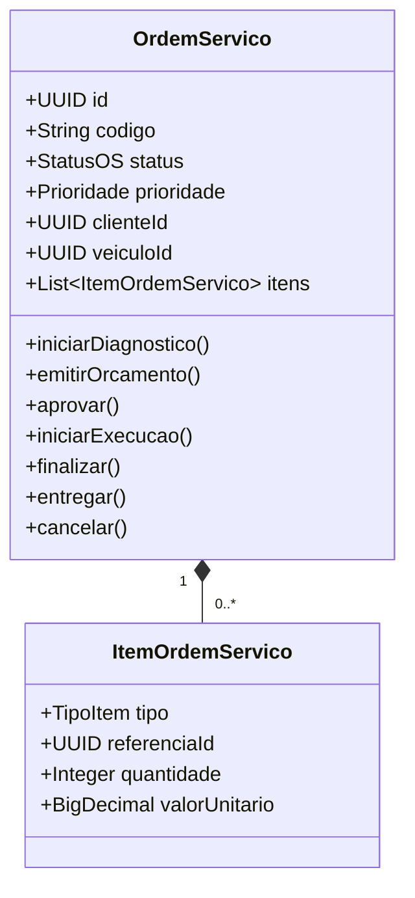
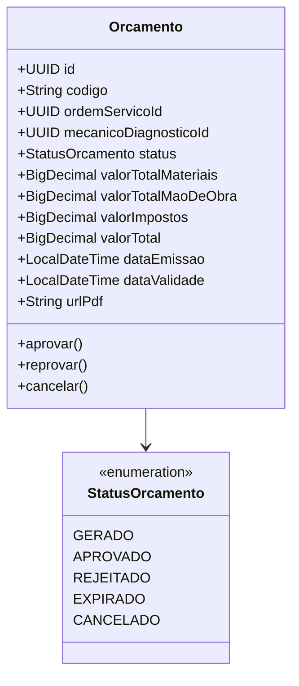
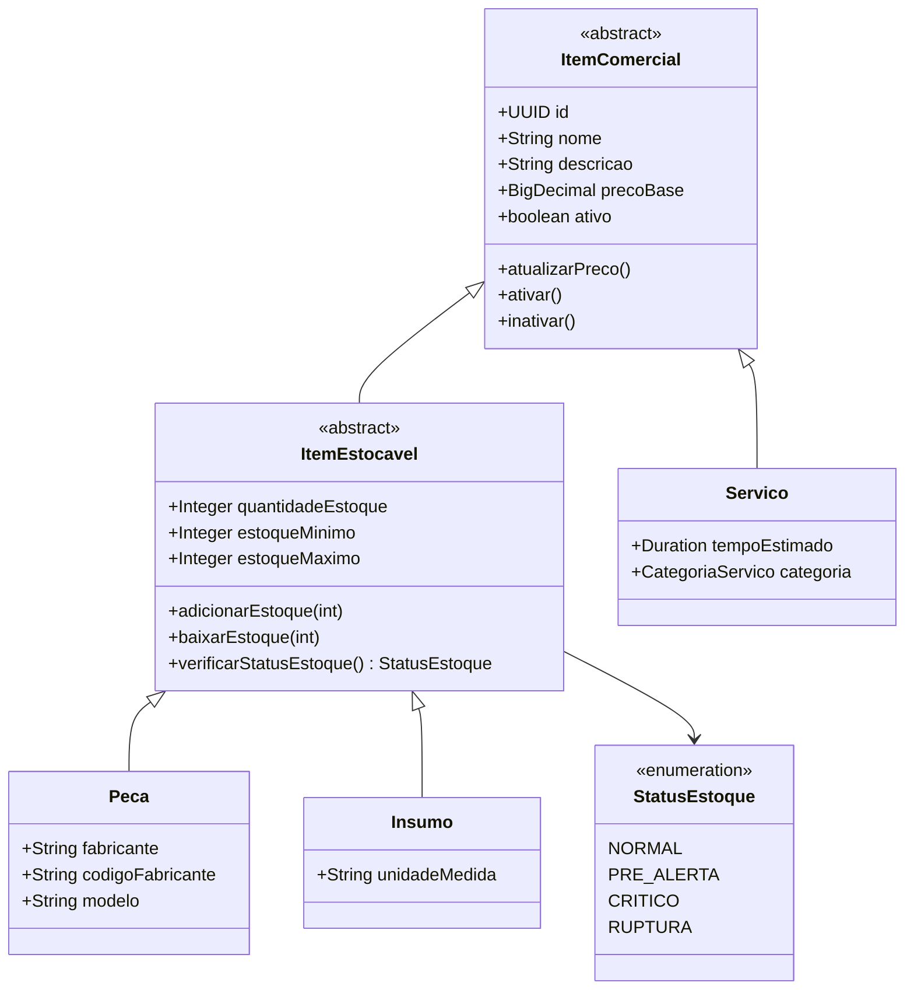
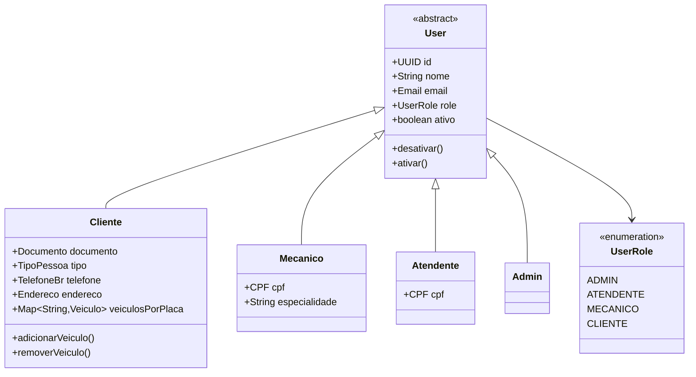
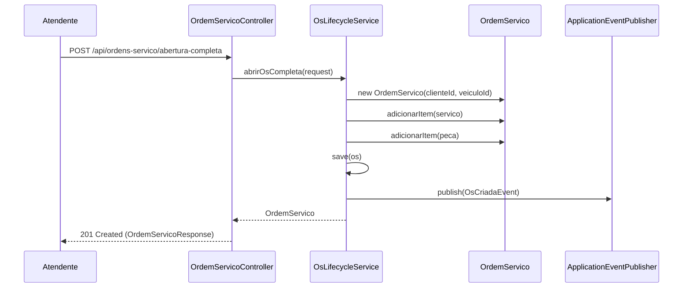
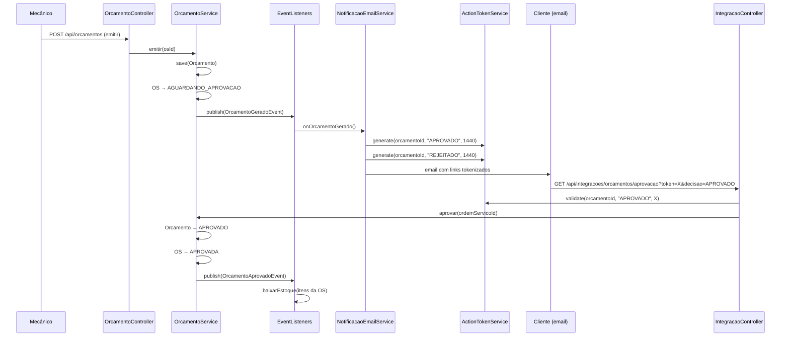

# Diagramas de Arquitetura — Mecânica API

---

## C4 Model — Nível 1: Contexto

```
┌──────────────────────────────────────────────────────────────────────┐
│  Usuários Internos                                                   │
│  (Atendente, Mecânico, Admin)                                        │
│         │                                                            │
│         │ HTTPS / JSON (JWT)                                         │
│         ▼                                                            │
│  ┌─────────────────────────────────────────────────┐                 │
│  │           Mecânica API                          │                 │
│  │   Backend de gestão de oficina mecânica         │◄── Cliente      │
│  │   Spring Boot 3.3 · Java 21 · PostgreSQL 16     │    (JWT/Link)   │
│  └───────────────────────┬─────────────────────────┘                 │
│                          │                                           │
│            ┌─────────────┴─────────────┐                            │
│            ▼                           ▼                            │
│      SMTP (MailHog/prod)         Sistemas Externos                  │
│      Notificações email          (aprovação M2M via API Key)        │
└──────────────────────────────────────────────────────────────────────┘
```

---

## C4 Model — Nível 2: Containers

```
┌────────────────────────────────────────────────────────────────────┐
│  Mecânica API — Sistema                                            │
│                                                                    │
│  ┌──────────────────────────────┐   ┌──────────────────────────┐  │
│  │  mecanica-app                │   │  PostgreSQL 16            │  │
│  │  Spring Boot 3.3 / Java 21   │──►│  Banco relacional        │  │
│  │  REST API + Swagger          │   │  Flyway migrations (V16) │  │
│  │  :8080                       │   │  :5433 (dev)             │  │
│  └──────────────────────────────┘   └──────────────────────────┘  │
│                                                                    │
│  ┌──────────────────────────────┐   ┌──────────────────────────┐  │
│  │  MailHog (dev)               │   │  Adminer                 │  │
│  │  Mock SMTP + Web UI          │   │  Browser de banco        │  │
│  │  :1025 (SMTP) / :8025 (web)  │   │  :8081                   │  │
│  └──────────────────────────────┘   └──────────────────────────┘  │
└────────────────────────────────────────────────────────────────────┘
```

---

## C4 Model — Nível 3: Componentes (Arquitetura Hexagonal)

```
                    HTTP Request
                         │
                         ▼
┌────────────────────────────────────────────────────────────────────┐
│  PRESENTATION                                                      │
│  Controllers ──► *ControllerApi (OpenAPI interfaces)               │
│  Request/Response DTOs · presentation/mapper/ · GlobalExceptionHandler│
└──────────────────────────────┬─────────────────────────────────────┘
                               │ chama
┌──────────────────────────────▼─────────────────────────────────────┐
│  APPLICATION                                                       │
│  *Service (interfaces) + *ServiceImpl                              │
│  Event Listeners (@TransactionalEventListener + @Async)            │
│  NotificacaoEmailApplicationService · PdfService                   │
└──────────────────────────────┬─────────────────────────────────────┘
                               │ usa Ports
┌──────────────────────────────▼─────────────────────────────────────┐
│  DOMAIN  (sem dependências externas)                               │
│  Entities: OrdemServico · Orcamento · Cliente · Veiculo            │
│  Hierarchy: User → Cliente/Atendente/Mecanico/Admin               │
│  Hierarchy: ItemComercial → Servico · ItemEstocavel → Peca/Insumo  │
│  Value Objects: CPF · CNPJ · Email · PlacaVeiculo · Endereco       │
│  Events: OsCriadaEvent · OrcamentoGeradoEvent · …                  │
│  Ports (interfaces): *Repository (13 interfaces)                   │
│  Exceptions: DomainRuleException · ResourceNotFoundException        │
└──────────────────────────────┬─────────────────────────────────────┘
                               │ implementado por
┌──────────────────────────────▼─────────────────────────────────────┐
│  INFRASTRUCTURE (Adapters)                                         │
│  Jpa*RepositoryAdapter → implements *Repository (ports)            │
│  JPA Entities: infra/entity/ (anotações JPA aqui, não no domínio)  │
│  infra/mapper/ (domain ↔ JPA entity)                               │
│  Security: JwtAuthenticationFilter · ApiKeyAuthFilter              │
│  Seeding: infra/seeding/ (dados de teste no boot)                  │
└────────────────────────────────────────────────────────────────────┘
```

**Regra de dependência:** as setas apontam sempre para o domínio. O domínio não importa nada de Spring, JPA ou HTTP.

---

## Modelo de Classes — Aggregate Root: OrdemServico

> **Referência:** atributos, enumerações e máquina de estados detalhados na [Linguagem Ubíqua](./linguagem_ubiqua.md).



---

## Modelo de Classes — Orcamento



---

## Modelo de Classes — Hierarquia de Itens do Catálogo



---

## Modelo de Classes — Usuários



---

## Diagrama de Sequência — Abertura Completa de OS (Fase 2)



---

## Diagrama de Sequência — Aprovação de Orçamento via Email



---

## Modelo de Dados (Esquema Principal)

```mermaid
erDiagram
    users {
        uuid id PK
        varchar nome
        varchar email UK
        varchar password_hash
        boolean account_status
        varchar user_type
    }
    clientes {
        uuid id PK_FK
        varchar documento UK
        varchar tipo_pessoa
        varchar telefone
        jsonb endereco
    }
    mecanicos {
        uuid id PK_FK
        varchar cpf UK
        varchar especialidade
    }
    atendentes {
        uuid id PK_FK
        varchar cpf UK
    }
    veiculos {
        uuid id PK
        uuid cliente_id FK
        varchar placa UK
        varchar marca
        varchar modelo
        int ano
    }
    ordens_servico {
        uuid id PK
        uuid cliente_id FK
        uuid veiculo_id FK
        uuid mecanico_diagnostico_id FK
        uuid mecanico_execucao_id FK
        varchar codigo UK
        varchar status
        varchar prioridade
        decimal valor_total
        timestamp data_entrada
        timestamp data_aprovacao
        timestamp data_fechamento
    }
    itens_ordem_servico {
        uuid id PK
        uuid ordem_servico_id FK
        varchar tipo
        uuid referencia_id
        varchar descricao
        decimal valor_unitario
        int quantidade
    }
    orcamentos {
        uuid id PK
        uuid ordem_servico_id FK
        uuid mecanico_diagnostico_id FK
        varchar codigo UK
        varchar status
        decimal valor_total_materiais
        decimal valor_total_mao_de_obra
        decimal valor_impostos
        decimal valor_total
        timestamp data_emissao
        timestamp data_validade
        varchar url_pdf
    }
    itens_comerciais {
        uuid id PK
        varchar tipo_item
        varchar nome
        text descricao
        decimal preco_base
        boolean ativo
        int quantidade_estoque
        int estoque_minimo
        int estoque_maximo
    }
    servicos {
        uuid id PK_FK
        int tempo_estimado_minutos
        varchar categoria
    }
    pecas {
        uuid id PK_FK
        varchar fabricante
        varchar codigo_fabricante
        varchar modelo
    }
    insumos {
        uuid id PK_FK
        varchar unidade_medida
    }
    revoked_tokens {
        uuid id PK
        varchar token UK
        timestamp revoked_at
        timestamp expires_at
    }

    users ||--o| clientes : "is-a"
    users ||--o| mecanicos : "is-a"
    users ||--o| atendentes : "is-a"
    clientes ||--o{ veiculos : possui
    clientes ||--o{ ordens_servico : solicita
    veiculos ||--o{ ordens_servico : recebe
    mecanicos ||--o{ ordens_servico : diagnostica
    mecanicos ||--o{ ordens_servico : executa
    ordens_servico ||--o{ itens_ordem_servico : contem
    ordens_servico ||--o{ orcamentos : possui
    itens_comerciais ||--o| servicos : "is-a (JOINED)"
    itens_comerciais ||--o| pecas : "is-a (JOINED)"
    itens_comerciais ||--o| insumos : "is-a (JOINED)"
```

> **Herança de usuários:** Joined Table Inheritance (`users` + tabelas filhas com PK = FK).
> **Herança de itens:** Joined Table Inheritance (`itens_comerciais` com coluna discriminadora `tipo_item`).

---

## Infraestrutura AWS (Fase 2)

```
┌─────────────────────────────────────────────────────────────────┐
│  VPC us-east-1                                                  │
│                                                                 │
│  ┌──────────────────────────────────────────────────────────┐   │
│  │  Subnet pública                                          │   │
│  │  NAT Gateway · ALB · NGINX Ingress Controller            │   │
│  └────────────────────────┬─────────────────────────────────┘   │
│                           │                                     │
│  ┌────────────────────────▼─────────────────────────────────┐   │
│  │  EKS Cluster (Kubernetes 1.33) — Subnet privada          │   │
│  │                                                          │   │
│  │  namespace: mecanica                                     │   │
│  │  ┌─────────────────────────────────────────────────┐     │   │
│  │  │  Deployment: mecanica-app                       │     │   │
│  │  │  Spring Boot 3.3 / Java 21                      │     │   │
│  │  │  replicas: 1–10 (HPA: CPU 70% / Mem 80%)        │     │   │
│  │  └─────────────────────────────────────────────────┘     │   │
│  │  ┌─────────────────────────────────────────────────┐     │   │
│  │  │  Deployment: postgres (PostgreSQL 16)            │     │   │
│  │  │  PVC: gp2 EBS (10Gi prod / 2Gi dev)             │     │   │
│  │  └─────────────────────────────────────────────────┘     │   │
│  │  ConfigMap + Secret (DB, JWT_SECRET, API_KEY)            │   │
│  └──────────────────────────────────────────────────────────┘   │
│                                                                 │
│  ECR — registry de imagens Docker                               │
│  Cert-Manager + Metrics Server                                  │
└─────────────────────────────────────────────────────────────────┘

CI/CD: GitHub Actions
  Push → Maven build + JaCoCo → Docker + Trivy scan → push ECR
       → kubectl apply -k k8s/overlays/<env>/
       → Flyway migrations (boot automático)
```

---

## Infraestrutura AWS (Fase 3 — operação corporativa)

```
┌─────────────────────────────────────────────────────────────────────────────────┐
│  VPC us-east-1 (compartilhada — Single source of truth: fiap-tc-mecanica-infra-k8s)│
│                                                                                 │
│  ┌────────────────────────────────────────────────────────────────────────┐    │
│  │  Subnets públicas                                                      │    │
│  │  NAT Gateway · NLB → Traefik (substitui NGINX)                         │    │
│  └────────────────────────────────────┬───────────────────────────────────┘    │
│                                       │                                        │
│  ┌────────────────────────────────────▼───────────────────────────────────┐    │
│  │  EKS Cluster 1.33 (subnets privadas)                                   │    │
│  │                                                                        │    │
│  │  ┌──────────────────┐  ┌──────────────────┐  ┌──────────────────┐     │    │
│  │  │ Traefik v3       │  │ mecanica-app     │  │ OTel Collector   │     │    │
│  │  │ IngressRoute:    │  │ Spring Boot 3.3  │  │ (DaemonSet)      │     │    │
│  │  │ /auth ──► API GW │  │ Java 21 + OTel   │──│ OTLP receivers   │     │    │
│  │  │ /api ──► app     │  │ agent (sidecar)  │  │ hostmetrics      │     │    │
│  │  │ rate-limit 50/s  │  │ HPA 1-10 (CPU)   │  │ kubeletstats     │     │    │
│  │  └────────┬─────────┘  └─────────┬────────┘  └────────┬─────────┘     │    │
│  │           │                      │                    │ OTLP HTTP     │    │
│  │           │ SNI                  │ JDBC               │               │    │
│  └───────────┼──────────────────────┼────────────────────┼───────────────┘    │
│              │                      │                    │                    │
│  ┌───────────▼─────────┐  ┌─────────▼──────────┐         │                    │
│  │ AWS API Gateway     │  │ AWS RDS PostgreSQL │         │                    │
│  │ POST /auth → Lambda │  │ 16 · db.t3.small   │         │                    │
│  └───────────┬─────────┘  │ Multi-AZ (prod)    │         │                    │
│              │            │ subnet privada     │         │                    │
│  ┌───────────▼─────────┐  │ backup 7 dias      │         │                    │
│  │ Lambda CPF→JWT      │  │ SG: 5432 from VPC  │         │                    │
│  │ Node.js 20 ARM64    │──┤ CIDR só            │         │                    │
│  │ · valida CPF        │  └────────────────────┘         │                    │
│  │ · busca cliente RDS │                                 │                    │
│  │ · JWT HS256 (mesma  │                                 │                    │
│  │   secret do app)    │                                 │                    │
│  └─────────────────────┘                                 │                    │
│                                                          │                    │
│  ECR · Cert-Manager · Metrics Server · ALB Controller    │                    │
└──────────────────────────────────────────────────────────┼────────────────────┘
                                                           │ OTLP
                                                           ▼
                                                ┌────────────────────────┐
                                                │ New Relic              │
                                                │ https://otlp.nr-data.net│
                                                │ · 2 dashboards (IaC)   │
                                                │ · 3 alertas NRQL       │
                                                │ · 100GB/mês free tier  │
                                                └────────────────────────┘

Repos separados (cada um com CI/CD próprio):
  fiap-tc-mecanica-app        (este Spring Boot)
  fiap-tc-mecanica-infra-k8s  (EKS + Traefik + OTel + Kustomize)
  fiap-tc-mecanica-infra-db   (RDS via terraform_remote_state)
  fiap-tc-mecanica-lambda     (Node.js + Terraform Lambda + API GW)
```

---

## Diagrama de Sequência — Autenticação de Cliente por CPF (Fase 3)

```
Cliente          Traefik          API Gateway AWS       Lambda            RDS             App (mecanica)
   │                │                    │                 │                │                  │
   │ POST /auth     │                    │                 │                │                  │
   │ {cpf: "..."}   │                    │                 │                │                  │
   ├───────────────►│                    │                 │                │                  │
   │                │ via ServersTrans-  │                 │                │                  │
   │                │ port (SNI + Host)  │                 │                │                  │
   │                ├───────────────────►│                 │                │                  │
   │                │                    │ invoke          │                │                  │
   │                │                    ├────────────────►│                │                  │
   │                │                    │                 │ valida CPF     │                  │
   │                │                    │                 │ (módulo 11)    │                  │
   │                │                    │                 │                │                  │
   │                │                    │                 │ findByDocumento│                  │
   │                │                    │                 ├───────────────►│                  │
   │                │                    │                 │◄───────────────┤                  │
   │                │                    │                 │  Cliente +     │                  │
   │                │                    │                 │  email + ativo │                  │
   │                │                    │                 │                │                  │
   │                │                    │                 │ sign JWT HS256 │                  │
   │                │                    │                 │ {sub: email,   │                  │
   │                │                    │                 │  id: UUID,     │                  │
   │                │                    │                 │  role: CLIENTE,│                  │
   │                │                    │                 │  exp: now+1h}  │                  │
   │                │                    │                 │ secret =       │                  │
   │                │                    │                 │ SECURITY_JWT_  │                  │
   │                │                    │                 │ SECRET_KEY     │                  │
   │                │                    │                 │ (mesma do app) │                  │
   │                │                    │◄────────────────┤                │                  │
   │                │                    │ 200 + JWT       │                │                  │
   │                │◄───────────────────┤                 │                │                  │
   │◄───────────────┤                    │                 │                │                  │
   │ 200 OK         │                    │                 │                │                  │
   │ {access_token, │                    │                 │                │                  │
   │  cliente: {…}} │                    │                 │                │                  │
   │                │                    │                                                     │
   │ GET /api/clientes/documento/{cpf}                                                         │
   │ Authorization: Bearer <jwt>                                                                │
   ├───────────────►│                                                                          │
   │                │ /api ──► mecanica-service                                                │
   │                ├──────────────────────────────────────────────────────────────────────────►│
   │                │                                                                          │
   │                │                                                              JwtAuthFilter│
   │                │                                                              extractUser  │
   │                │                                                              loadByEmail  │
   │                │                                                              isTokenValid │
   │                │                                                              (verifica    │
   │                │                                                              assinatura   │
   │                │                                                              HS256 com    │
   │                │                                                              mesma secret)│
   │                │                                                                          │
   │                │                                                              @PreAuthorize│
   │                │                                                              hasRole      │
   │                │                                                              ('CLIENTE')  │
   │                │                                                              AND          │
   │                │                                                              isOwnerByDoc │
   │                │                                                                          │
   │                │◄─────────────────────────────────────────────────────────────────────────┤
   │◄───────────────┤                                                              200 {cliente}│
   │ 200 OK         │                                                                          │
```

**Pontos-chave:**

- A `SECURITY_JWT_SECRET_KEY` é a **única** chave em todo o sistema — injetada via K8s Secret no app E como variável Terraform no Lambda (idealmente via AWS Secrets Manager, hoje via env var compartilhada).
- O `JwtAuthenticationFilter` do app **não sabe e não precisa saber** se o JWT veio da Lambda ou de `/oauth/token` — qualquer JWT HS256 válido com `subject = email_existente` é aceito.
- O `@PreAuthorize` com `@securityService.isOwnerByDocumento(authentication, #documento)` garante object-level security: cliente só vê seus próprios dados.
- Cobertura de testes deste fluxo: `src/test/java/com/fiap/mecanica/integration/JwtFromExternalIssuerIT.java` (3 cenários: aceito, subject desconhecido, secret errada).

